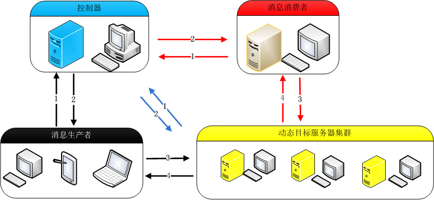

# ActiveMQ Balancer #
### introduction ###
Apache ActiveMQ ™ is the most popular and powerful open source messaging and Integration Patterns server.see more: [http://activemq.apache.org](http://activemq.apache.org "Apache ActiveMQ")
However, there are some disadvantages when use ActiveMQ Servers as Cluster.  

1. Manage and configurate cluster difficultly when the number of the cluster increases.  
2. Need a balance when there are many message producer. 

### key features ###
1. Manage the ActiveMQ Servers in the clusters easily using the ClusterController and ActiveMQMonitor. 
2. Balance the input streams using **consistent hashing method** when dispathch connecting URL.
3. Client API supperted language include **Java,c#,c/c++** 
4. Using [eclipse jetty](http://www.eclipse.org/jetty/ "eclipse jetty") as web server and [google protocol buffer](http://code.google.com/p/protobuf/ "google protocol buffer") as the transport protocol between controller and message client
5. The communication process between ClusterController and ActiveMQMonitor using [Apache Mina](http://mina.apache.org) network application framework 

## architecture ##

How to the ActiveMQ Balancer work:

1. Download the [apache activemq server](http://activemq.apache.org/download.html "download ")
2. Make sure one Server IP point to one ActiveMQ Server.
3. Download the ActiveMQMonitor from the release folder, then put the folder next to the ActiveMQ Server. 
4. Download the ClusterController from the release folder. 
5. Start the programmer above. You have a ActiveMQ Server clusters now.

Assume you have a message producer and a message consumer. 

1.	The message producer use the  ClusterLinkForClient API  to get the ActiveMQ Server IP from ClusterController.   
2.	Then the ClusterController response to the message producer with a available ActiveMQ Server IP.  
3.	The message producer can connect the ActiveMQ Server after get the ActiveMQ Server IP.  
4.	The message consumer can connect the ActiveMQ Server after do the same step above. **Make sure your message producer and consumer's queue name or topic name are same in order to connect the right message queue or topic**.

## ClusterController ##
#### SystemConfig.xml ####
	<?xml version="1.0" encoding="UTF-8"?>  
	<root>
	   <brokerServer>
	   		<port>9992</port>
	   		<channelkey>1234567890_brokerlink_channelkey</channelkey>
	   		<heartbeattime>5000</heartbeattime><!-- 心跳时间1000为1秒钟 -->
	   		<virtualnode>5</virtualnode>
	   </brokerServer>
	   <clientServer>
	   		<port>9991</port>
	   		<channelkey>1234567890_clientlink_channelkey</channelkey>   	
	   </clientServer>
	   <transportConnectors>
            <!-- DOS protection, limit concurrent connections to 1000 and frame size to 100MB -->
	        <transportConnector name="openwire" uri="tcp://0.0.0.0:61616"/>
	        <transportConnector name="amqp" uri="amqp://0.0.0.0:5672"/>
	        <transportConnector name="stomp" uri="stomp://0.0.0.0:61613"/>
	        <transportConnector name="mqtt" uri="mqtt://0.0.0.0:1883"/>
	        <transportConnector name="ws" uri="ws://0.0.0.0:61614"/>
	  </transportConnectors>   
	</root>

## ActiveMQMonitor ##

	<?xml version="1.0" encoding="UTF-8"?>
	<root>
   		<controllerServer>
			<!-- the clusterController Server's IP -->
	   		<ip>159.226.95.156</ip>
	   		<!-- same as the ClusterController's brokerServer node in SystemConfig.xml -->
			<port>9992</port>	   		
			<channelkey>1234567890_brokerlink_channelkey</channelkey>
	   		<heartbeattime>5000</heartbeattime>
			<
	   		<monitorport>11099</monitorport>
    	</controllerServer>   
   
	</root>

## ClusterLinkForClient ##

	<?xml version="1.0" encoding="UTF-8"?>
	<root>
	    <controllerServer>
			<!-- the clusterController Server's IP -->
		   	<ip>159.226.95.156</ip>
		   	<!-- same as the ClusterController's clientServer node in SystemConfig.xml -->
			<port>9991</port>
		   	<channelkey>1234567890_clientlink_channelkey</channelkey>
	    </controllerServer> 
	</root>

## Reference ##
	

	1. http://activemq.apache.org
	2. http://www.eclipse.org/jetty/
	3. http://code.google.com/p/protobuf/
	4. http://mina.apache.org
	
##Notice##

If find ary Bug, contact with me, **email:elegantyuanjian@gmail.com**. Have Fun.
